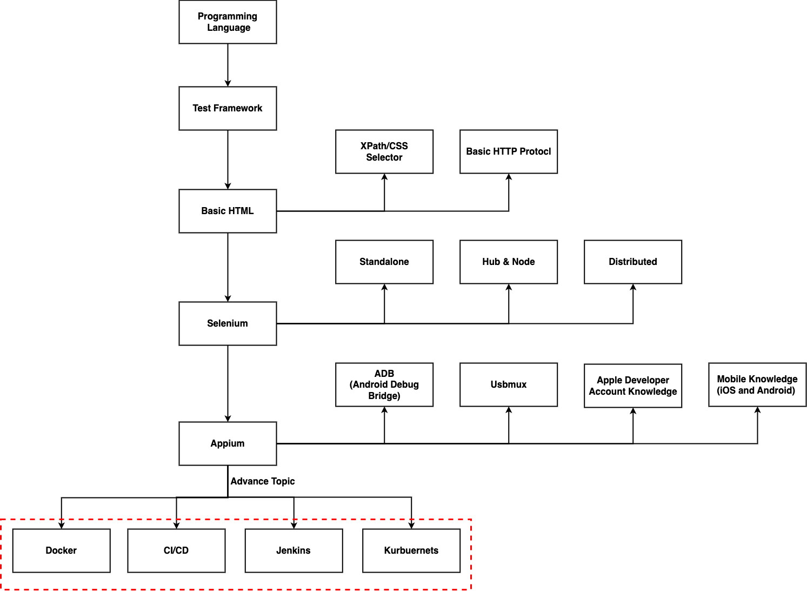

# Automation Testing

The site is used for demonstrated how to set up the automation testing environment

## The following links are resources that we used

- [Appium](http://appium.io/)
- [Allure Report Framework](https://docs.qameta.io/allure-report/)
- [Docker-Android](https://github.com/budtmo/docker-android)
- [Docker-Selenium](https://github.com/SeleniumHQ/docker-selenium)
- [Docker-OSX](https://github.com/sickcodes/Docker-OSX)
- [Selenium Official Site](https://www.selenium.dev/documentation/overview/)
- [Selenium with Python](https://selenium-python.readthedocs.io/)
- [Pytest](https://docs.pytest.org/en/7.2.x/)

## Learning Path

