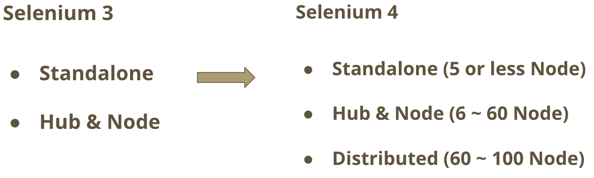
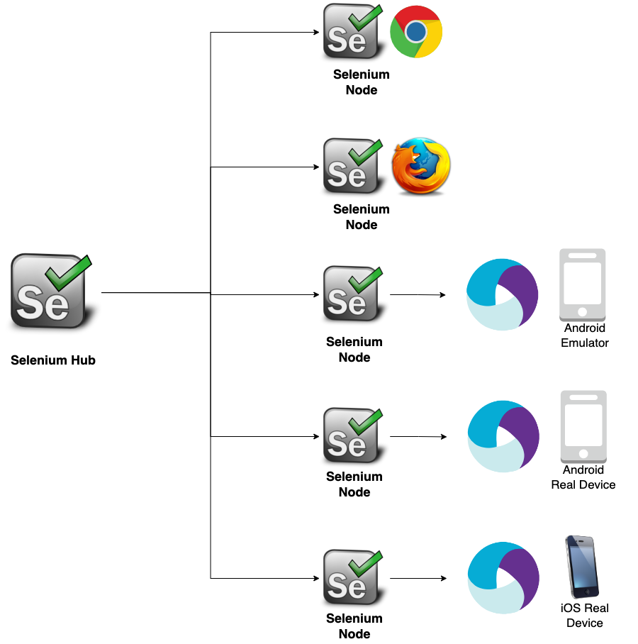
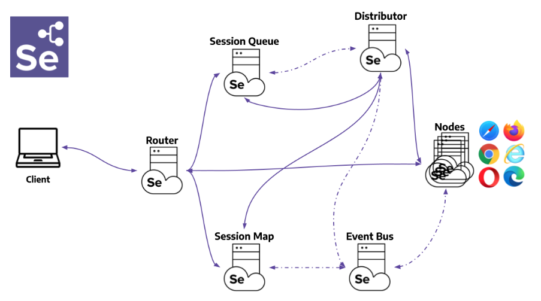
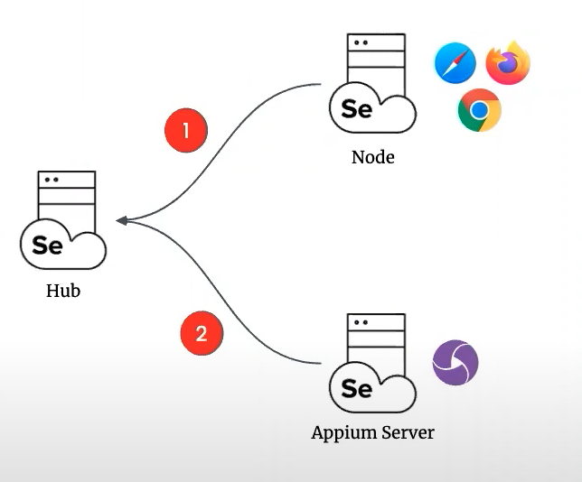
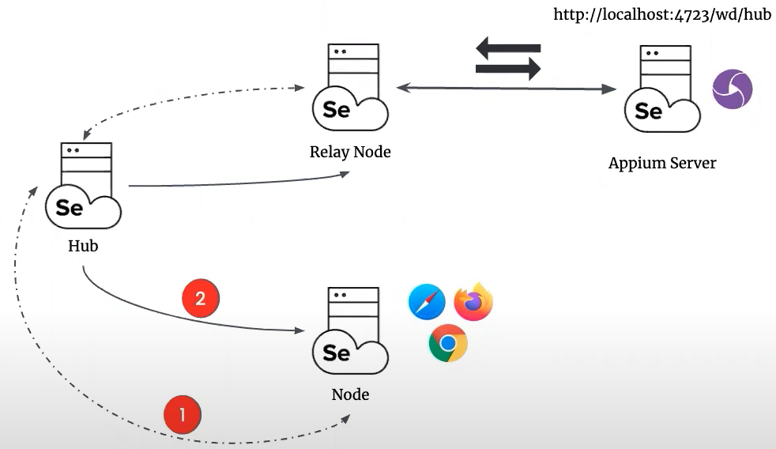
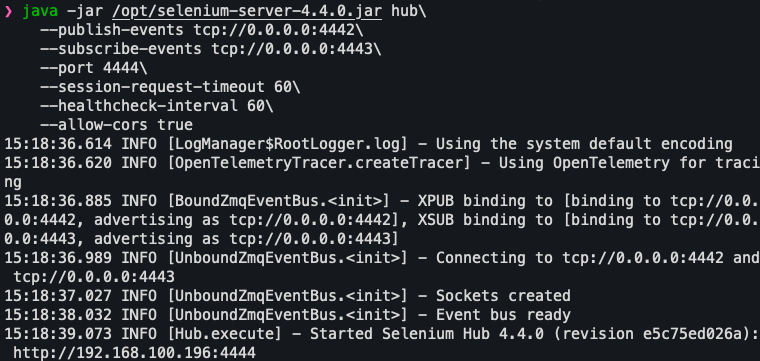
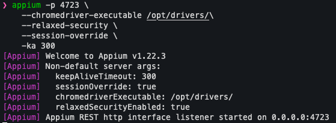
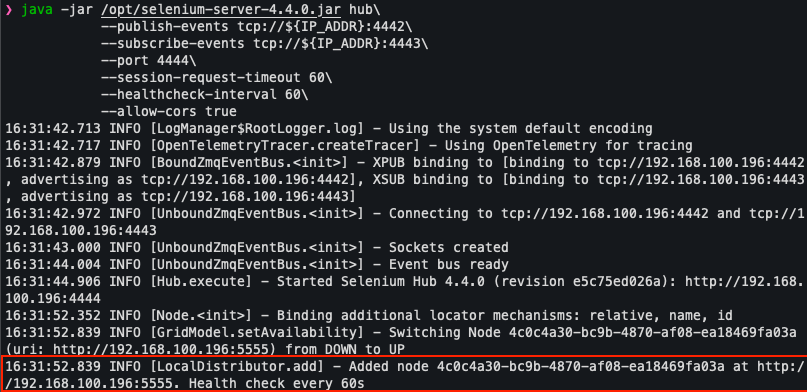
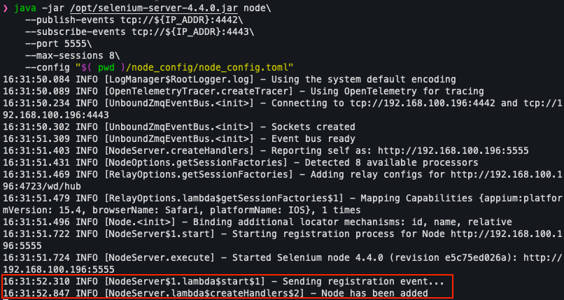
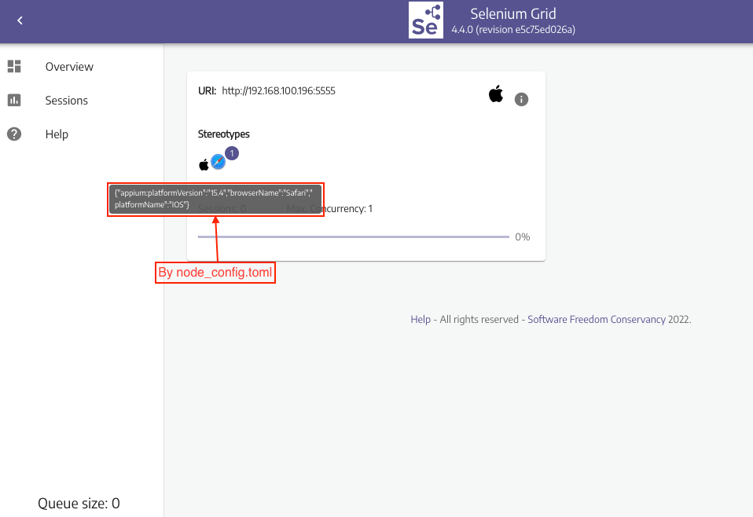

# Selenium

## What's difference between `Selenium3` and `Selenium4`?

- `Selenium4` adds the new mode which is called `distributed mode`. It's purpose for containerization and cloud-scalability. More details can refer to [selenium official documentation](https://www.selenium.dev/documentation/grid/components/)

    <div style="text-align:center">
    
    </div>

- **Hub-Node mode**

    <div style="text-align:center">
    
    </div>

- **Distributed mode**

    <div style="text-align:center">
    
    </div>

- Explain [what is selenium gird and when to use it](https://www.selenium.dev/documentation/grid/)

## How dose appium register at grid node between selenium3 and selenium4?

- **Selenium3**
  - Appium server can be registered by `--node-config` server parameter. In the node config file you have to define the `browserName`, `version` and `platform` and based on these parameters the gird will redirect your test to the right device. Example for [`appium --node-config`](https://appium.io/docs/en/advanced-concepts/grid/)

    <div style="text-align:center">
    
    </div>

- **Selenium4**
  - Appium no longer needs to use `--node-config` server parameter to register at gird node. Instead, selenium4 adds new feature `Relay` allows you to proxy Appium requests to an appium server instance.

    <div style="text-align:center">
    
    </div>

  - As mentioned before, appium no longer use `--node-config`, but we have to define the `node-config` for `selenium-node`. The `node-config` use `toml` format for config file which consists of sections and each sections has options and its respective values.

    ```bash
    # This is an example for node-config.toml

    [server]
    port = 5555

    [node]
    detect-drivers = false


    [relay]
    url = "http://localhsot:4723/wd/hub"
    status-endpoint = "/status"
    configs = [
        "1", "{\"browserName\":\"Safari\", \"platformName\": \"iOS\"}"
    ]
    ```

  - ***Note:*** Strongly recommend watching this [appium conference](https://www.youtube.com/watch?v=3_aP2rsqZD0) which explains how selenium gird work and why selenium4 has `relay` feature

## Getting Started with Selenium Grid

- Before starting selenium grid, you have to setup the environment. Please refer to [here](./setup-android-ios-env.md)

- Download the [selenium server](https://github.com/SeleniumHQ/selenium/releases/download/selenium-4.4.0/selenium-server-4.4.0.jar) and move it to `/opt` directory

- Start `Selenium Hub`

  - Open the new terminal and typing the below commands

    ```shell
    # Get ip address
    IP_ADDR=$( ip route get 1.2.3.4 | awk -F " " '{print $7}' )

    # Start Hub
    java -jar /opt/selenium-server-4.4.0.jar hub\
        --publish-events tcp://${IP_ADDR}:4442\
        --subscribe-events tcp://${IP_ADDR}:4443\
        --port 4444\
        --session-request-timeout 60\
        --healthcheck-interval 60\
        --allow-cors true
    ```

  - ***Note:*** Add parameter `--log-level FINEST` to adjust the log level for helping debug

  <div style="text-align:center">
  
  </div>

- Start Appium

  - Open the new terminal and typing the below command

    ```shell
    appium -p 4723 \
        --relaxed-security \
        --session-override \
        -ka 300
    ```

  - ***Note:*** If you want to test chrome on your device, you need to download the [`chrome driver`](https://chromedriver.chromium.org/downloads) which must confirm the browser version of your device. After downloading the chrome driver, you need to add `--chromedriver-executable ${DRIVER_PATH}` while starting the appium server.

    <div style="text-align:center">
    
    </div>

- Start `Selenium Node`

  - Open the new terminal and typing the below command

    ```shell
    # Get ip address
    IP_ADDR=$( ip route get 1.2.3.4 | awk -F " " '{print $7}' )

    # Start Node
    java -jar /opt/selenium-server-4.4.0.jar node\
        --publish-events tcp://${IP_ADDR}:4442\
        --subscribe-events tcp://${IP_ADDR}:4443\
        --port 5555\
        --max-sessions 8\
        --config "$( pwd )/node_config.toml"
    ```

    - **Note:** If `selenium hub` start on the another machine, the `${IP_ADDR}` should be set hub machine ip address. And ensure the two machine network can communicate with each other

- Check the each terminal after register

  - Selenium Hub
    <div style="text-align:center">
      
    </div>

  - Selenium Node

    <div style="text-align:center">
      
    </div>

  - Open [`http://localhost:4444/ui`](http://localhost:4444/ui)

    <div style="text-align:center">
      
    </div>

### Reference

- [Selenium Official Site](https://www.selenium.dev/)
- [How to register appium at selenium grid node?](https://appium.io/docs/en/advanced-concepts/grid/)
- [Selenium Grid 4 and Appium together in harmony by Diego Molina #AppiumConf2021](https://www.youtube.com/watch?v=3_aP2rsqZD0)
- [Getting started with Selenium Grid](https://www.selenium.dev/documentation/grid/getting_started/)
