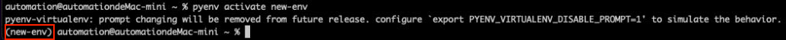
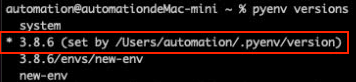
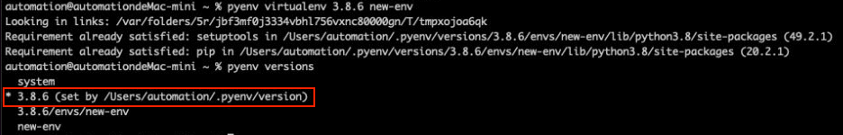

# How to install Pyhton on Linux and MacOS?
- [pyenv](https://github.com/pyenv/pyenv) is an open-source tool used for managing multiple python environments.

## MacOS

- Make sure have [homebrew](https://brew.sh/) installed

    ```shell
    /bin/bash -c "$(curl -fsSL https://raw.githubusercontent.com/Homebrew/install/HEAD/install.sh)"
    ```

- Install dependencies pyenv requires

    ```shell
    brew update
    brew install openssl readline sqlite3 xz zlib
    ```

- Install pyenv

    ```shell
    brew install pyenv

    # pyenv virtual environment management plugin
    brew install pyenv-virtualenv
    ```

- Update shell to ensure autocomplete for pyenv is functional

    ```shell
    # Note:
    # If you use zsh, you should update the file ~/.zshrc rather than ~/.bash_profile

    echo 'export PYENV_ROOT="$HOME/.pyenv"' >> ~/.bash_profile

    echo 'command -v pyenv >/dev/null || export PATH="$PYENV_ROOT/bin:$PATH"' >> ~/.bash_profile

    echo -e 'if command -v pyenv 1>/dev/null 2>&1; then\n  eval "$(pyenv init -)"\nfi' >> ~/.bash_profile

    echo -e 'eval "$(pyenv virtualenv-init -)"' >> ~/.bash_profile

    # Reload the shell
    exec "$SHELL"
    ```

## Linux

- Install dependencies pyenv requires

    ```shell
    sudo apt-get update

    sudo apt-get install -y --no-install-recommends \
        make \
        build-essential \
        libssl-dev \
        zlib1g-dev \
        libbz2-dev \
        libreadline-dev \
        libsqlite3-dev \
        wget \
        curl \
        llvm \
        libncurses5-dev \
        xz-utils \
        tk-dev \
        libxml2-dev \
        libxmlsec1-dev \
        libffi-dev \
        liblzma-dev
    ```

- Install pyenv and pyenv-virtualenv

    ```shell
    curl https://pyenv.run | bash
    ```

- Update shell to ensure autocomplete for pyenv is functional

    ```shell
    export PATH="$HOME/.pyenv/bin:$PATH"
    eval "$(pyenv init --path)"
    eval "$(pyenv virtualenv-init -)"
    ```

## How to use pyenv and pyenv-virtualenv?

- List available version that you can install

    ```shell
    pyenv install --list | grep 3.8
    ```

    

- Install the specific version

    ```shell
    # Install Python 3.8.6
    pyenv install 3.8.6

    # Show current installed versions
    pyenv versions

    # Set Python 3.8.6 as global version
    pyenv global 3.8.6
    ```

    

### pyenv-virtualenv

- Create virtual environment by pyenv-virtualenv plugins

    ```shell
    # Use python 3.8.6 to create virtual environment, and its name is `new-env`
    pyenv virtualenv 3.8.6 new-env
    ```

    

- Activate the virtual environment

    ```shell
    pyenv activate new-env
    ```

    

- Deactivate the virtual environment

    ```shell
    pyenv deactivate
    ```

- Delete the virtual environment

    ```shell
    pyenv virtualenv-delete -f new-env
    ```

### Python default `venv` module

- Create a new folder

    ```shell
    cd ~
    mkdir new-project
    cd new-project
    ```

- Create virtual environment

    ```shell
    # Create a new environment directory .venv
    python -m venv .venv
    ```

- Activate the virtual environment

    ```shell
    source .venv/bin/activate
    ```

- Deactivate the virtual environment

    ```shell
    deactivate
    ```