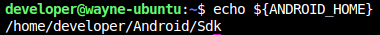

# Setup Linux for Android and iOS Automation

Use `Ubuntu 20.04` as environment

## Step 1: Install Java8(OpenJDK version  "1.8.0_342")

```shell
sudo apt install openjdk-8-jdk
```

## Step 2: Setup Java Path

```shell
# Set Java Path
export JAVA_HOME="/usr/lib/jvm/java-8-openjdk-amd64"
export PATH="$JAVA_HOME/bin:$PATH"
```

Verify Java Version

```shell
java --version
```


## Step 3: Install Android Studio

- Add android studio official repository into your system.

    ```shell
    sudo apt-add-repository ppa:maarten-fonville/android-studio
    ```

- After successfully adding the android repository, you will update your system `apt-cache` by the follow command

    ```shell
    sudo apt-update
    ```

- After updating `apt-cache`, it's time to install `Android Studio` by `apt` package manager. Below command will help you install it with all its dependencies

    ```shell
    sudo apt install android-studio
    ```

- Launch Android Studio by application launcher searcher. After launching the application, you will need to install `Android SDK` and `SDK Tools`.

  - Install Android SDK platform
    

  - Install SDK Tools
    

## Step 4: Setup Required path for Android Studio

- Open `~/.bashrc` and add below commands.

    ```shell
    # Android Path
    export ANDROID_HOME="/home/$( whoami )/Android/Sdk"
    export PATH="$ANDROID_HOME/platform-tools:$PATH"
    export PATH="$ANDROID_HOME/tools:$PATH"
    export PATH="$ANDROID_HOME/tools/bin:$PATH"
    export PATH="$ANDROID_HOME/build-tools/33.0.0:$PATH"
    export PATH="$ANDROID_HOME/build-tools/33.0.0/bin:$PATH"
    export PATH="$ANDROID_HOME/emulator:$PATH"
    ```

- Note that this setting `ANDROID_HOME` and `PATH` doesn't load into the session. Please execute below commands to make sure all things are right

    ```shell
    # Reload the shell
    exec "${SHELL}"

    echo "${ANDROID_HOME}"
    ```

    

    ```shell
    echo "${PATH}"
    ```

    

- Verify android SDK and SDK tools are right or not

    ```shell
    sdkmanager --list

    # It will popup the window
    uiautomatorviewer
    ```

## Step 5: Install NVM

**`NMV`** is an open-source tool used for managing node version

```shell
sudo apt install curl
curl https://raw.githubusercontent.com/creationix/nvm/master/install.sh | bash
```

```shell
nvm --version
```

## Step 6: Install Appium

```shell
# Download node.js with v16.17.0
nvm install v16.17.0

# Set v16.17.0 as node default version
nvm alias default 16.17

# Install appium and appium-doctor on global
npm install -g appium@1.22.3 appium-doctor

# Diagnostic your current environment for iOS
appium-doctor --ios

# Diagnostic your current environment for android
appium-doctor --android
```

## Step 7: Install Python and [tidevices](https://github.com/alibaba/taobao-iphone-device)

- Install Python

    More details can refer to [here](./install-python/install-python.md)

- Install [tidevices](https://github.com/alibaba/taobao-iphone-device)

    tidevice is an open-source which is used for communicate with iOS device and execute the WDA(WebDriverAgent) without Xcode.

    ```shell
    pip install --upgrade pip

    pip install -U "tidevice[openssl]"
    ```

## Step 8: Install Required Packages and Tools

- FFmpeg

    ```shell
    sudo apt update
    sudo apt install ffmpeg
    ```

- socat

    ```shell
    sudo apt update
    sudo apt-get install socat
    ```

- [libplist](https://github.com/libimobiledevice/libplist)

    A small portable C library to handle Apple Property List files in binary or XML format

  - Install all required dependencies and build tools:

    ```shell
    sudo apt-get install \
        build-essential \
        checkinstall \
        git \
        autoconf \
        automake \
        libtool-bin \
        doxygen \
        cython
    ```

  - Then clone the actual project repository

      ```shell
      git clone https://github.com/libimobiledevice/libplist.git
      cd libplist
      ```

  - Build and install it

      ```shell
      ./autogen.sh
      make
      sudo make install
      ```

- [libimobiledevice](https://libimobiledevice.org/)

    A library to communicate with services on iOS devices using native protocols

    ```shell
    sudo apt-get install usbmuxd libimobiledevice6 libimobiledevice-utils
    ```

- [usbfluxd](https://github.com/corellium/usbfluxd)

    Redirects the standard usbmuxd socket to allow connections to local and remote usbmuxd instances so remote devices appear connected locally.

    > ***Note: Before installing the usbfluxd, you need to make sure `libplist` has been installed***

  - Clone the repository and change the current directory

      ```shell
      git clone https://github.com/corellium/usbfluxd.git
      cd usbfluxd
      ```

  - Build and install it

      ```shell
      ./autogen.sh
      make
      sudo make install
      ```

  - Add the new path into `~/.bashrc`

      ```shell
      export PATH="/usr/local/sbin:${PATH}"
      ```

- Verify all installation

  - Prepare an iOS device and and connect to the computer through out the USB cable, then open the terminal typing the below commands

      ```shell
      systemctl status usbmuxd
      ```

      

  - If usbmuxd doesn't activate, typing the below command to start it.

      ```shell
      sudo systemctl start usbmuxd
      ```

  - After the usbmuxd has been started, then using `socat` to expose `/var/run/usbmuxd` on port 5000

      ```shell
      sudo socat -d -d tcp-listen:5000,fork unix-connect:/var/run/usbmuxd
      ```

      

  - Open a new terminal and use `usbfluxd` to redirect the standard `usbmuxd` socket to allow connections to local and remote device appear locally

      ```shell
      # Get ip address
      IP_ADDR=$( ip route get 1.2.3.4 | awk -F " " '{print $7}' )

      # Redirect the socket
      sudo usbfluxd -f -r ${IP_ADDR}:5000
      ```

      
