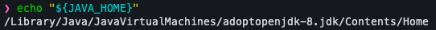

# Setup MacOS for Android and iOS Automation

## Step 1: Install Homebrew

Homebrew is the most popular MacOS package manager. Homebrew installs packages to their own directory and then symlinks their files into `/usr/local.`

 ```shell
 /bin/bash -c "$(curl -fsSL https://raw.githubusercontent.com/Homebrew/install/HEAD/install.sh)"
 ```

## Step 2: Install Java8(OpenJDK version "1.8.0_292")

Install by `Homebrew`

```shell
brew install --cask adoptopenjdk/openjdk/adoptopenjdk8
```

Verify installation by Java cli

```shell
java -version
```


## Step 3: Setup the Java Version

If you use `zsh`, open `~/.zshrc` file to add below commands. Otherwise, add into `~/.profile` file. If your environment has multiple version of Java, make sure using the Java 8.

```shell
# Note:
# There are many ways to open the `~/.zshrc` file. ex: `vim`, `nano`, etc.

# Use open command to open it, and it will open the file by system default app
open ~/.zshrc
```

```shell
# Set Java Path
export JAVA_HOME="/Library/Java/JavaVirtualMachines/adoptopenjdk-8.jdk/Contents/Home"

export PATH="/usr/local/Cellar/maven/3.8.6/bin:${PATH}"
```

Note that this setting `JAVA_HOME` doesn't load into the session. Please execute the below commands to make sure all things are right

```shell
# Reload the shell
exec "${SHELL}"

# Verify the setting
echo "${JAVA_HOME}"
```



## Step 4: Install Android Studio

1. Download the [Android Studio](https://developer.android.com/studio/), and launch the application

    

2. Open the app click on Next, and configure and click on `finish`

    

3. Install SDK version as required your project

    

    

4. Install SDK Tools

    

5. Setup the required path, like the Step 3, add below commands into `~/.zshrc` or `~/.profile`

    ```shell
    # Set Android Path
    export ANDROID_HOME="/Users/$( whoami )/Library/Android/sdk"
    export PATH="$ANDROID_HOME/platform-tools:$PATH"
    export PATH="$ANDROID_HOME/tools:$PATH"
    export PATH="$ANDROID_HOME/tools/bin:$PATH"
    export PATH="$ANDROID_HOME/build-tools/33.0.0:$PATH"
    export PATH="$ANDROID_HOME/build-tools/33.0.0/bin:$PATH"
    export PATH="$ANDROID_HOME/emulator:$PATH"
    ```

6. Reload the `~/.zshrc` and then execute the below command to verify the setting

    ```shell
    # Reload the shell
    exec "${SHELL}"

    sdkmanager --list

    # It will popup the window
    uiautomatorviewer
    ```

## Step 5: Install Xcode from app store

Open the app store, and typing xcode on search button then install it

1. Open the Xcode from applications folder and install required components

    

2. Install command line if you haven't installed

    ```shell
    xcode-select --install
    ```

3. Install Carthage
    - Change the permissions and accept the Xcode license.

        ```shell
        sudo chown -R $(whoami) /usr/local/share/man/man5 /usr/local/share/man/man7

        sudo xcodebuild -license accept
        ```

    - Install Carthage by homebrew

        ```shell
        brew install carthage
        ```

## Step 6: Install Appium

Install `nvm` by Homebrew, `nvm` is node version manager tool

```shell
# nvm is node.js version manager tool
brew install nvm

# Download node.js with v16.17.0
nvm install v16.17.0

# Set v16.17.0 as node default version
nvm alias default 16.17

# Install appium and appium-doctor on global
npm install -g appium@1.22.3 appium-doctor

# Diagnostic your current environment for iOS
appium-doctor --ios

# Diagnostic your current environment for android
appium-doctor --android
```

## Step 7: Install [libimobiledevice](https://libimobiledevice.org/#downloads)

libimobiledevice is A cross-platform FOSS library written in C to communicate with iOS devices natively

```shell
brew install libimobiledevice
```

## Step 8: Install libplist

1. Install prerequests packages

    ```shell
    brew install make automake autoconf libtool pkg-config gcc
    ```

2. Clone the project

    ```shell
    git clone https://github.com/libimobiledevice/libplist.git
    cd libplist
    ```

3. Now you can build and install it

    ```shell
    ./autogen.sh
    make
    sudo make install
    ```

## Step 9: Install usbmuxd

1. Clone the project

    ```shell
    git clone https://github.com/libimobiledevice/usbmuxd.git
    cd usbmuxd
    ```

2. Now you can build and install it

    ```shell
    ./autogen.sh
    make
    sudo make install
    ```

## Step 10: Install usbmuxd

1. Clone the project

    ```shell
    git clone https://github.com/corellium/usbfluxd.git
    cd usbfluxd
    ```

2. Now you can build and install it

    ```shell
    ./autogen.sh
    make
    sudo make install
    ```

## Step 11: Setup required path

Like the Step 3, add below commands into `~/.zshrc` or `~/.profile`

```shell
export PATH="/usr/local/sbin:${PATH}"
```

## Step 12: Install [ifuse](https://github.com/libimobiledevice/ifuse)

```shell
brew install ifuse
```

## Step 13: Install [ffmpeg](https://ffmpeg.org)

A complete, cross-platform solution to record, convert and stream audio and video.

```shell
brew install ffmpeg
```

### Reference

- [Setup Appium on MacOS for Android and iOS App Automation](https://krishnachetan.medium.com/setup-appium-on-mac-1e06f1178427)
- [How to Install Appium on MacOS with Required Tools](https://www.swtestacademy.com/how-to-install-appium-on-mac/)
